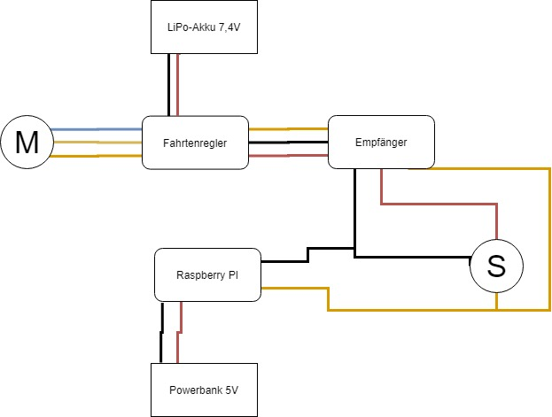

# Project SELMA - SELbstfahrendes Modell Auto

The project was created in connection with the integration seminar in the Data Science course at the Baden-Württemberg Cooperative State University (DHBW) Mannheim. An extended documentation is stored as a scientific elaboration as PDF.

## Getting Started

### Step 1 - Install all dependencys

Therefore simply run the [install.sh](install.sh)
This will install all needed libaries, that can be found in [dependencies.txt](dependencies.txt) and [apt.txt](apt.txt).

### Step 2 - Install the pi to the car

Therefore you need to connect the camera to the pi and change the wiring harness of the car as shown below:

### Step 3 - Run the car

Now you can use the [run_car.py](./main/run_car.py) or [main.py](./main/main.py) script to either just controll the car or also see the detection in the local network via localhost:5000/.

## Built With

* [OpenCV](https://opencv.org)
* [YOLO](https://pjreddie.com/darknet/yolo/)
* [RPi.GPIO](www.raspberrypi.org/)
* [Flask](https://palletsprojects.com/p/flask/)

## Authors

* **Jan Brebeck** - *PiCar* - [Brebeck-Jan](https://github.com/Brebeck-Jan)
* **Andreas Bernrieder** - *Object Detection* - [Phantomias3782](https://github.com/Phantomias3782)
* **Simon Scapan** - *Lane Detection* - [SimonScapan](https://github.com/SimonScapan)
* **Thorsten Hilbradt** - *Contribution* - [Thorsten-H](https://github.com/Thorsten-H)

## License

This project is licensed under the MIT License - see the [LICENSE.md](LICENSE) file for details

## Acknowledgments

Special Thanks to:
*  Soumya Ranjan Behera and his [Lane Line Detection](https://www.kaggle.com/soumya044/lane-line-detection/notebook) which was used as a Blueprint for this Lane Detection Pipeline.
* EbenKouao for his [Pi Camera Stream Flask](https://github.com/EbenKouao/pi-camera-stream-flask) which was used to implement our livestream.
